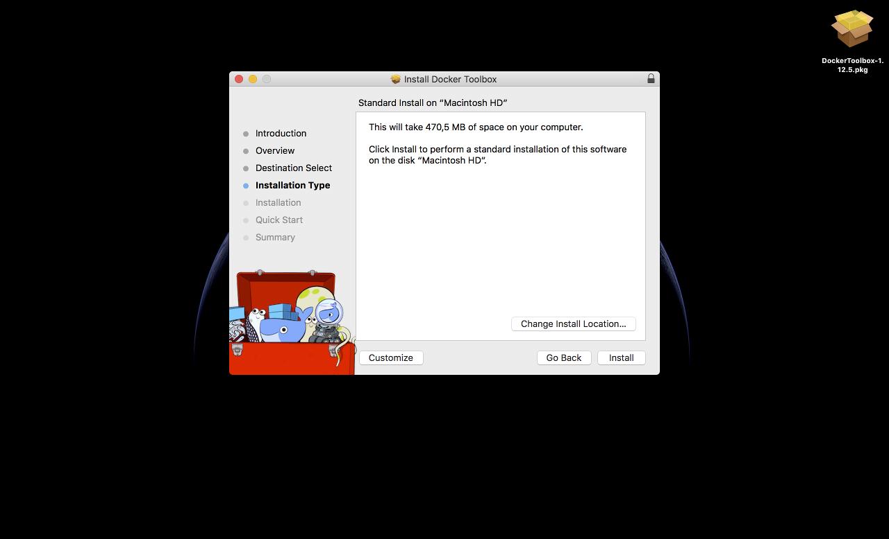
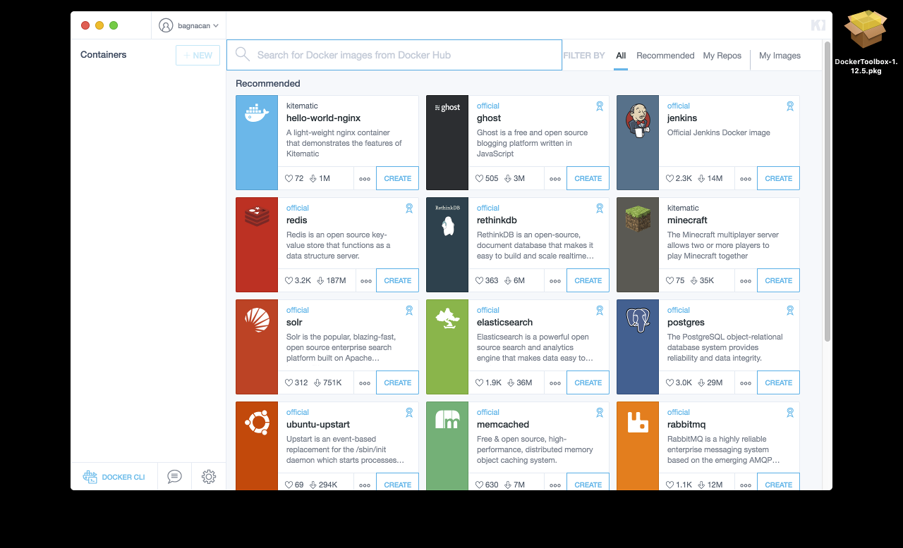
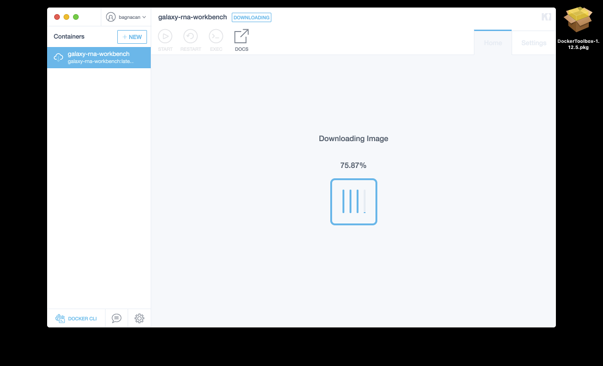
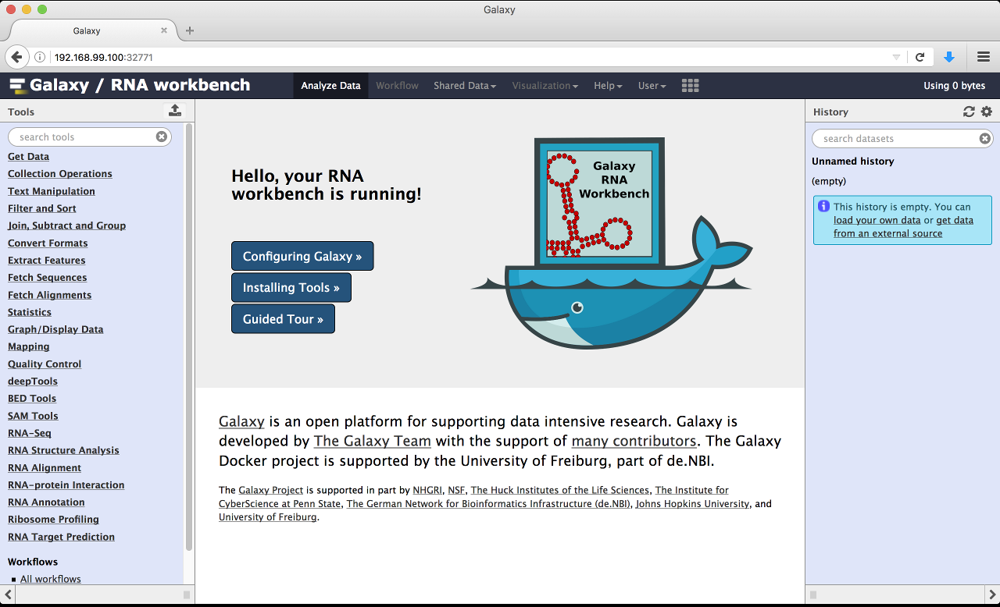

<div id="top"></div>

# Galaxy RNA workbench on Kitematic for Mac OSX

This how-to will guide you through the steps that are needed to run the Galaxy RNA workbench on Mac OSX by setting up [Kitematic](https://kitematic.com), a tool which provides a graphical user interface to run Docker containers stored on [Docker Hub](https://hub.docker.com/).

- [Installation prerequisites](#installation-prerequisites)
- [Installation procedure](#installation-procedure)
- [Launching the workbench](#launching-the-workbench)
- [Taking a tour](#taking-a-tour)
- [Troubleshooting](#troubleshooting)

## Installation prerequisites

Before proceeding, make sure your system is up to date using App Store's update manager.  
Finally, go to Kitematic's [page](https://kitematic.com/), and download the *Docker Toolbox*.
<p align="right"><a href="#top">&#x25B2; back to top</a></p>

## Installation procedure

The following instructions are based on our Kitematic installation [screencast](https://www.youtube.com/watch?v=ssnea4HXVfE):

1. Once downloaded, place the Docker Toolbox installer where it is more convenient for you (here we placed it on the desktop for simplicity). Once the Docker Toolbox package is fully downloaded, double-click to proceed to its installation.

  

2. The Docker Toolbox installer starts. Click _Continue_ to proceed with the installation.

  

3. The installer gives an overview of what is provided in the Docker Toolbox. As you can see, Kitematic is going to be installed alongside Docker, providing a desktop GUI for managing its images and containers. Click _Continue_.

  

4. Click on the drive where you want to install the Docker Toolbox. Click _Continue_.

  

5. The Docker Toolbox installer provides different types of installation settings, where you can select the different components that are required to run Docker images. Click _Customize_ to review the components and fine-tune your installation, or leave the installation at its defaults (what we did here) by clicking _Install_.

  

6. Click _Continue_ to finalize the installation. Kitematic will be installed within your system's Applications directory

  

The installation is now complete.
<p align="right"><a href="#top">&#x25B2; back to top</a></p>

## Launching the workbench

1. Locate the Kitematic icon within your system's Applications directory, and launch it. The Docker GUI starts. Let it load.

  

2. Once loaded, the GUI asks you to connect to Docker Hub to retrieve publicly available Docker images.  
  Insert your credentials, and click _Login_.

  

3. Once logged in, the GUI shows some popular Docker images readily available for running on your system.  
  We are interested in the _Galaxy RNA workbench_. Type _galaxy-rna-workbench_ in the search bar located on the top of the window to search for this image on the Docker Hub.

  

4. The search dialog shows the retrieved results. Select the first on the left by clicking _Create_.

  

5. A connection to the Docker Hub is started for the retrieval of the RNA workbench.

  

  Running out of space? Check out our [_troubleshooting_](#Running-out-of-space) section.

6. Once fully downloaded, the Docker container starts, loggin messages on the console. A web preview of the Galaxy RNA workbench is provided next to the console log. Click on the preview window to open it in a browser.

  

7. The workbench is opened in your default browser, where you can readily start working on your workflows.

  

The opening page shows some useful options to configure Galaxy, install new tools, or try the workbench through guided tours. Tours are interactive demos that show how the interface works in different usage scenarios.
<p align="right"><a href="#top">&#x25B2; back to top</a></p>

## Taking a tour

Try the workbench through a guided tour. Tours are interactive, and can be stopped at any time, providing you an overview of what can be done through Galaxy, using its tools, and reusing all available workflows.

To have an introductory tour on how to get accustomed with the Galaxy interface, click on _Help -> Interactive Tours_, and select the _Galaxy UI_ tour.

  

Your Galaxy RNA workbench tour has started. Have fun! :)
<p align="right"><a href="#top">&#x25B2; back to top</a></p>

## Troubleshooting

#### Running out of space

Kitematic creates virtual machines with a default storage space of 20GB. The RNA workbench is roughly 12GB, therefore if you want to increase disk space, use the *Docker CLI* (Docker Command Line Interface) that was installed alongside Kitematic.

Once opened, expand the storage space of your virtualbox default machine with the following command:
```
docker-machine -D create -d virtualbox --virtualbox-disk-size "100000" default
```
This error is likely to happen when you try to download the workbench a second time on the same virtual machine, after having stopped and removed the container that was created the first time your run it. In this case you can avoid resizing the storage space: just create a new container by clicking _+ New_, and go to the _My Images_ tab. You will see a list of all the images you already downloaded from Docker Hub. Locate the one of the RNA workbench, and click _create_.
<p align="right"><a href="#top">&#x25B2; back to top</a></p>

